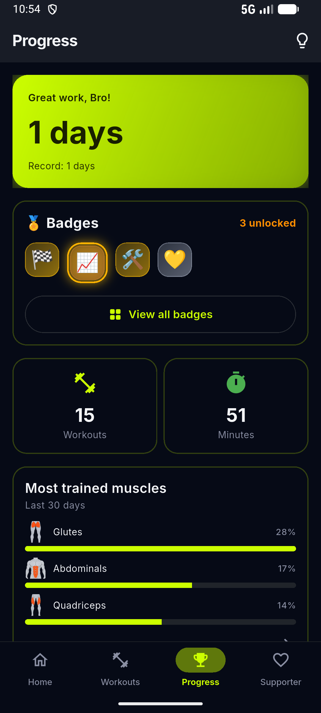
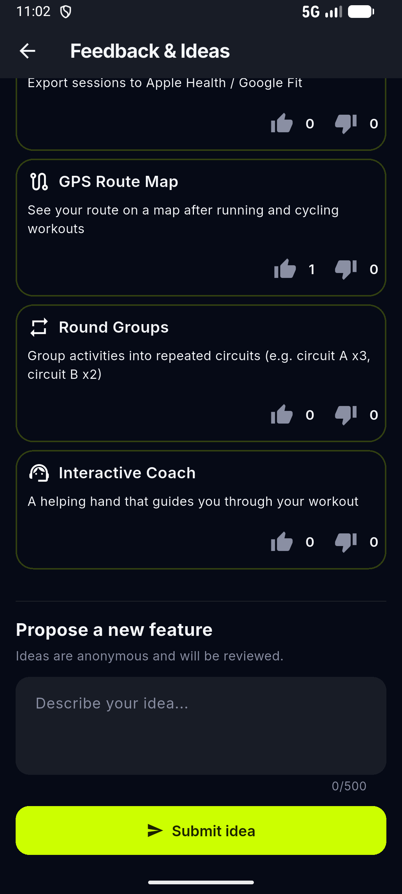

# Blocktomic — Features Guide

> Deep dive into progress tracking, gamification, personalization, and more.

---

## Progress & Stats

  

### Dashboard
The Progress tab gives you an overview of your training:

- **Streak counter**: number of consecutive days you've worked out (with personal record).
- **Total workouts**: lifetime count of completed sessions.
- **Training minutes**: total minutes spent training.
- **Badges**: latest unlocked badge displayed prominently.

### Calendar Heatmap
A visual calendar shows your training days:

- **Color intensity**: more minutes = darker cell.
- **Weekly view**: current week breakdown.
- **Monthly view**: full month at a glance.
- **Tap any day**: opens a filtered history view for that day.

### Trend Charts
The **Trend Screen** shows how your training evolves over time:

| Chart | What it shows |
|---|---|
| **Quality trend** | Average feedback rating per session over time |
| **Distance trend** | Total distance per session (running/cycling) |
| **Duration trend** | Total workout duration over time |

Use trends to spot patterns: are you training longer? Running farther? Feeling better?

### History

Every completed and interrupted session is saved in **History**. Tap any session to see:

- Start time and date
- Duration (total) and net training time (without rest)
- Distance and average speed (if applicable)
- Per-block details:
  - Block name and activity
  - Actual duration / distance / reps completed
  - Feedback rating (Easy / Normal / Hard / Not completed)
  - Weight used (for gym blocks)
- Badges earned in that session
- Delete button to remove the session

---

## Badges (Gamification)

Blocktomic's badge system rewards consistency, volume, and exploration. There are 14 badges across 5 families.

### Badge Families

#### Consistency — Train regularly

| Badge | Requirement | Tier |
|---|---|---|
| **First Workout** | Complete 1 workout | Gold |
| **3-Day Streak** | Train 3 days in a row | Bronze |
| **7-Day Streak** | Train 7 days in a row | Silver |
| **30-Day Streak** | Train 30 days in a row | Gold |

#### Volume — Train a lot

| Badge | Requirement | Tier |
|---|---|---|
| **10 Workouts** | Complete 10 total workouts | Bronze |
| **50 Workouts** | Complete 50 total workouts | Silver |
| **100 Workouts** | Complete 100 total workouts | Gold |
| **10 Hours Training** | Accumulate 600 minutes | Bronze |
| **50 Hours Training** | Accumulate 3000 minutes | Gold |

#### Quality — Train well

| Badge | Requirement | Tier |
|---|---|---|
| **5 "Good" in a Row** | Rate 5 consecutive blocks as "Good" | Gold |

#### Exploration — Try everything

| Badge | Requirement | Tier |
|---|---|---|
| **Explorer** | Try every pre-built workout at least once | Gold |
| **First Custom** | Create your first custom workout | Gold |

#### Milestone — Special moments

| Badge | Requirement | Tier |
|---|---|---|
| **Welcome Back!** | Return after more than 30 days away | Gold |
| **Supporter** | Watch a rewarded ad or make a donation | Silver |

### Unlocking Badges

Badges are checked automatically:
- After completing a workout
- When you open the Progress tab
- A notification animation plays when a new badge is earned

---

## Personalization

### Visual Styles (4)

| Style | Feel |
|---|---|
| **Classic** | Clean, minimal, quiet-luxury surfaces |
| **Vibrant** | Bold, energetic colors |
| **Athletic** | Sporty, high-contrast — default |
| **Overdrive** | Intense, dramatic |

### Accent Colors (9)

Default **Cyan**. Each accent ships with tuned light and dark palettes:

| Color | Light primary | Dark primary |
|---|---|---|
| **Cyan** (default) | `#00B8D4` | `#00F0FF` |
| **Green** | `#2E7D32` | `#7ED18A` |
| **Orange** | `#E65100` | `#FFA726` |
| **Violet** | `#6A1B9A` | `#C724F5` |
| **Fuchsia** | `#F50057` | `#FF0099` |
| **Neon Red** | `#FF1744` | `#FF0A44` |
| **Neon Pink** | `#FF0066` | `#FF00AA` |
| **Neon Lime** | `#7CB342` | `#CCFF00` |
| **Neon Blue** | `#1A46D9` | `#1F51FF` |

  

### Activity Colors in Dark Theme

Every activity keeps its own color across timer, editor and history. In dark theme, activity backgrounds are automatically dimmed for readability — except **neon** activity colors, which stay vivid by design.

### Fun Workout Names & Taglines

Pre-built workouts ship with two names: a classic one (*Classic Tabata*) and a catchy one (*Phoenix Protocol*).

- With **fun names on** (default), cards lead with the catchy title; the classic name plus an info line (`Family · estimated duration`, or the planned distance for running workouts) sit underneath.
- With **fun names off**, cards show the classic name with the same info line.
- Toggle it on the last onboarding page — with a live preview on real cards — or in Settings.
- **Duplicating** a pre-built workout keeps its catchy title and difficulty.
- Card durations are estimates: warm-up and cool-down count once, core blocks are multiplied by the number of rounds.

  

### Theme

- **System**: follows your device theme (Light/Dark).
- **Light**: always light mode.
- **Dark**: always dark mode (great for low-light workouts).

### Profile

From Settings > Profile, you can set:

- **Name**: displayed in the app.
- **Photo**: take with camera or choose from gallery.
- **Weight**: used for weight-based calculations (kg or lb).
- **Height**: used for BMI or future features (cm or ft/in).
- **Birth date**: used for age-based metrics.

### Units

| Setting | Options |
|---|---|
| **Distance** | Kilometers (km) or Miles (mi) |
| **Weight** | Kilograms (kg) or Pounds (lb) |

All workout data converts automatically when you switch units.

---

## Supporter System

Blocktomic is free and has no mandatory ads or subscriptions. The **Supporter** system is a voluntary way to support development.

### How to Become a Supporter

**Method 1: Watch a Rewarded Ad**
1. Go to **Support** tab.
2. Tap **Watch an Ad**.
3. Watch a 15–30 second video.
4. Supporter badge activates for **15 days** or **30 workouts** (whichever comes first).

**Method 2: PayPal Donation**
1. Go to **Support** tab.
2. Tap **Donate via PayPal**.
3. You are redirected to PayPal.Me in your browser.
4. Complete the donation.
5. Return to the app and confirm.
6. Supporter badge activates for **30 days**.

### Supporter Badge

- Displayed in the Progress tab and profile area.
- **Always visible**: even when expired, it shows you've supported the app.
- When expired, the badge dims to indicate it's inactive.
- Renew anytime by watching another ad or donating again.

### Weekly Reminder

If your Supporter badge is expired:
- A weekly notification appears every Monday at 10:00 AM.
- Tapping the notification opens the Support tab.
- You can turn off reminder notifications in device settings.

---

## Privacy Controls

Blocktomic is **privacy-first by design**.

### What's Always Local

These never leave your device:

- All workout data (history, sessions, blocks)
- Profile information (name, photo, weight, height)
- GPS tracking data
- App settings (theme, units, language)

### Optional Data Sharing

You can **opt in** to share anonymous data:

- **Firebase Analytics**: helps understand which features are used most.
- **Crashlytics**: sends crash reports to help fix bugs.

Both are **off by default**. You control this:
- **First launch**: a consent dialog appears.
- **Anytime**: toggle in Settings > Privacy.

No personal data (name, email, location history) is included in analytics.

### Permissions

| Permission | When Needed | Why |
|---|---|---|
| **Location** | Only during a GPS workout | Track distance per interval |
| **Notifications** | For weekly Supporter reminder | Remind to support the app |

---

## Feedback & Voting

In the **Feedback & Ideas** screen (reachable from the app-bar icon on many screens, including Settings and the Support tab):

- **Vote on future features**: see what's planned and vote for what matters most (e.g. *Pace Targets* — per-block pace goals for running and cycling).
- **Suggest ideas**: propose new features for the community.

This data is stored in Firebase (anonymous). Your identity is never revealed.

  

---

## Sharing Workouts (QR & links)

Any workout (pre-built or custom) can be shared:

1. Tap the **share** button on a workout card or preview.
2. A sheet opens with a **QR code** and a **link**.
3. Send the link via any app (WhatsApp, Telegram, email…) or let a friend scan the QR with their camera.
4. The recipient opens/scans it → **Import Preview** → taps **Import**: a new unique copy is created in their library (never overwrites existing).

Behind the scenes Blocktomic uses the best link available:

- **Online**: the anonymous workout payload is published and you get a short link to share.
- **Offline / publish failure**: the full workout is encoded in the link itself (`…?d=<payload>`), so sharing always works.

The shared payload contains only the workout structure (blocks, times, distances) — no personal data.

  

### Import Behavior

- The imported workout gets a **new unique ID**.
- Importing the same link multiple times creates **separate copies**.
- Activities are matched by ID. If an activity doesn't exist on the recipient's device, a fallback is used.