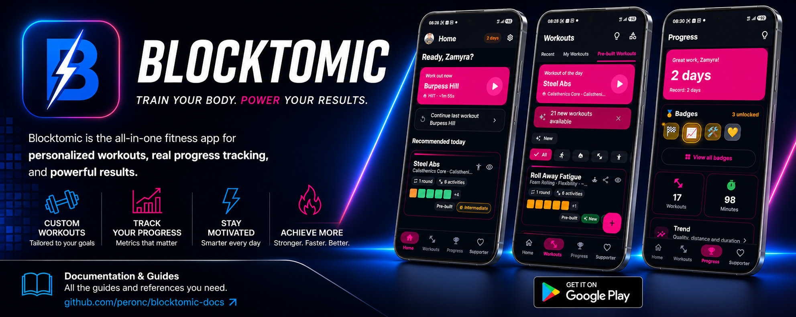

  

# Blocktomic

Blocktomic is an offline-first workout timer and tracker for interval training (Tabata, HIIT, endurance and strength workouts). The App provides:
- creation and management of custom workouts and activities;
- a workout timer with audio/vibration cues and optional GPS distance tracking;
- a local history of completed sessions, progress tracking and badges;
- optional anonymous statistics (only with your consent, see Section 5).

The App does not require a user account. Your profile and workout data are stored locally on your device

Developed with passion, willpower, and lots of hopes.

### Blocktomic is much more than a Tabata & HIIT timer: customize your workouts, build gym routines, and train running and cycling. Designed for anyone who wants to train without complications, without an account, and with maximum flexibility.

## Documentation

This repository is published via GitHub Pages: the site root shows the marketing
landing page ([index.html](index.html)).

| Document | Description |
|---|---|
| [index.html](index.html) | Landing page (marketing) |
| [USER_GUIDE.html](USER_GUIDE.html) | User guide (English) |
| [USER_GUIDE.it.html](USER_GUIDE.it.html) | Guida per l'utente (italiano) |
| [FAQ.html](FAQ.html) | Frequently Asked Questions |
| [WORKOUT_GUIDE.html](WORKOUT_GUIDE.html) | Workout catalog & reference |
| [FEATURES_GUIDE.html](FEATURES_GUIDE.html) | Features deep dive |
| [PRIVACY_POLICY.html](PRIVACY_POLICY.html) | Privacy Policy |
| [TERMS_OF_SERVICE.html](TERMS_OF_SERVICE.html) | Terms of Service |
