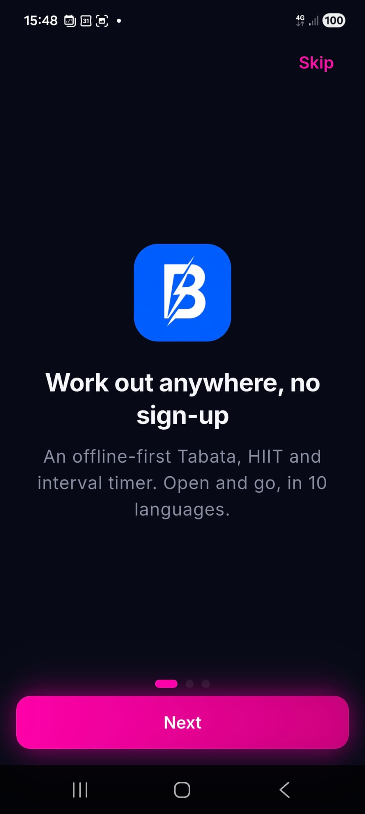
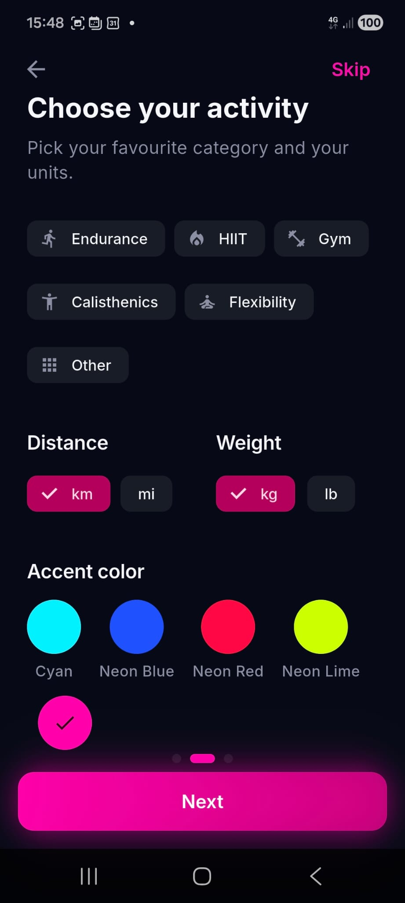
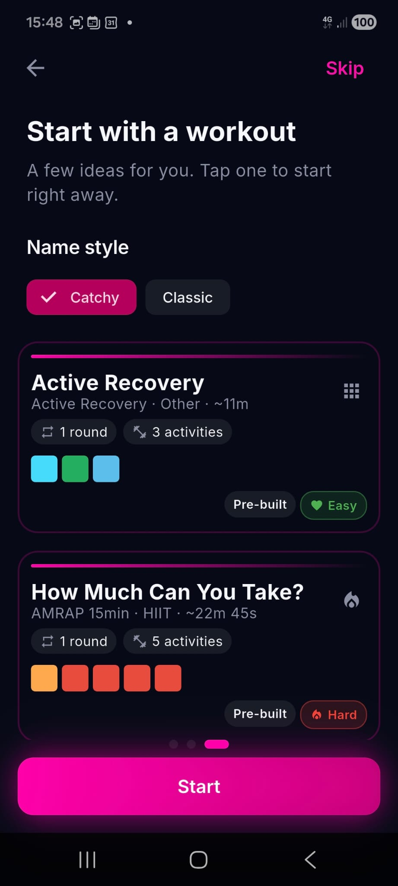
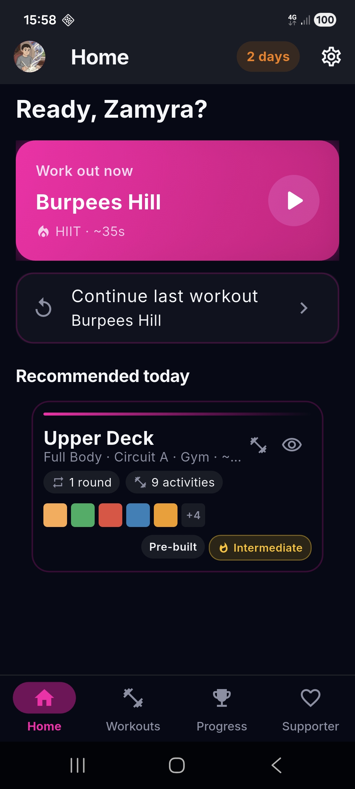
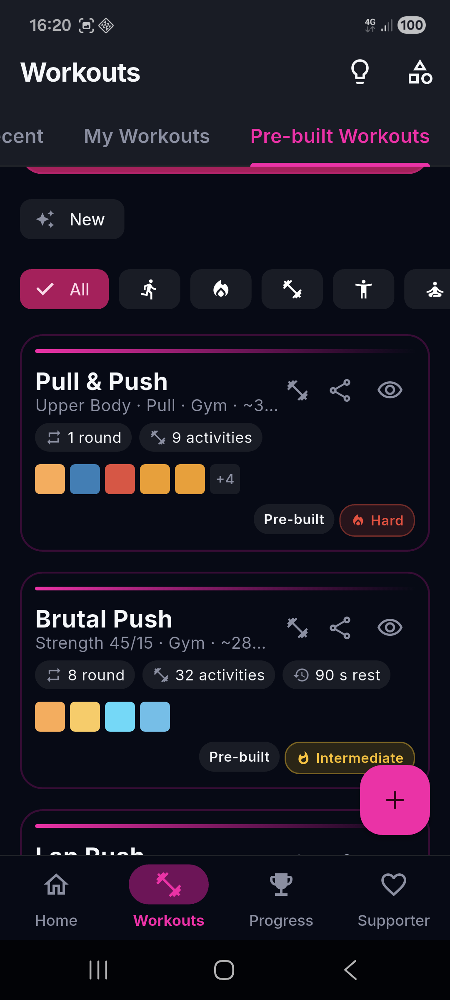
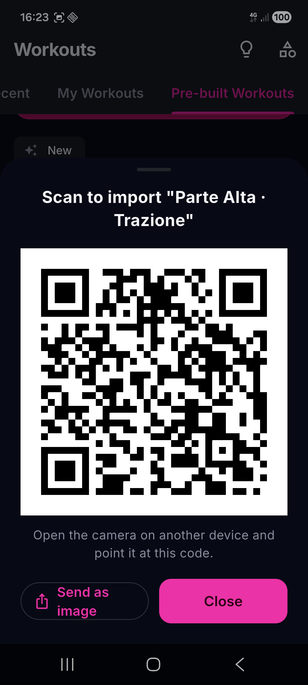
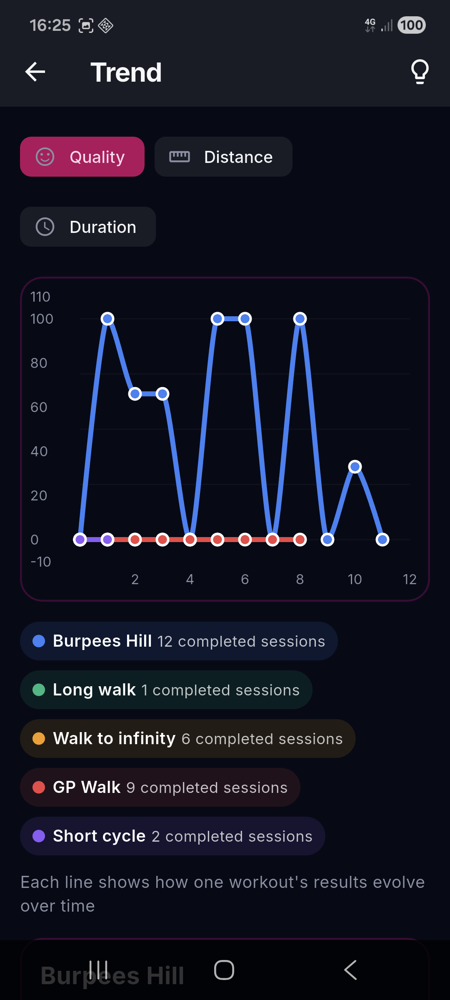
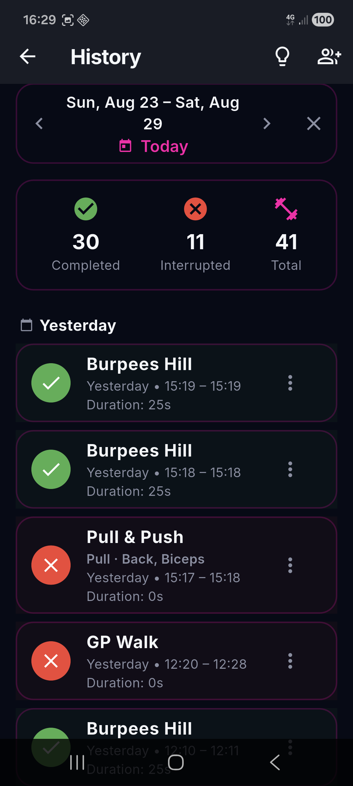
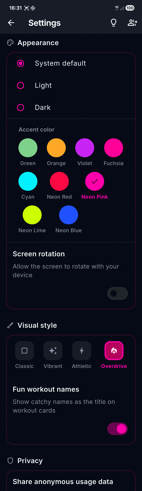
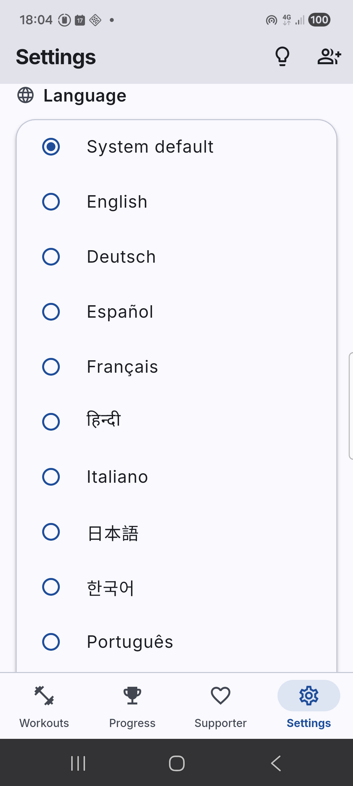

# Blocktomic — Guida per l'utente

Blocktomic è un timer e tracciatore di allenamenti a intervalli (Tabata, HIIT,
endurance e forza) che funziona offline. Niente account, niente registrazione:
i tuoi workout, le sessioni e il profilo sono salvati solo sul tuo dispositivo.

> 🇬🇧 English guide: [USER_GUIDE.md](USER_GUIDE.md)

---

## 1. Avvio rapido

1. Apri Blocktomic → l'**onboarding** appare al primo avvio:

   - **Benvenuto** — una breve introduzione all'app.
   - **Preferenze** — scegli la famiglia di attività preferita, le unità di distanza/peso e il colore accent (Cyan di default, più quattro tonalità Neon).
   - **Suggerimenti** — scegli lo **stile dei nomi** (*Spiritosi* o *Normali*) con anteprima dal vivo su card reali e, se vuoi, avvia subito un allenamento.

   Tocca **Salta** per andare dritto alla schermata **Home**.

  
  
  

2. Nella schermata **Home** trovi tre azioni: **Allenati ora** (avvia l'ultimo/consigliato), **Continua l'ultima** (ripete l'ultimo workout completato), **Consigliato oggi** (suggerimento deterministico basato sulla tua attività preferita).
3. Apri la libreria **Workouts** → tocca una card workout predefinito (es. *Tabata Classico*, *HIIT 30/30*, *Corsa con Ripetute*) — o creane uno tuo.
4. Un breve countdown (default **5 secondi**) ti dà il tempo di prepararti: tocca **Salta** per partire subito, o **Annulla** per tornare indietro.
5. Segui gli intervalli. Alla fine valuta la sessione (😊 😐 😰) e vedi i tuoi risultati.

Ecco fatto: un allenamento parte in due tocchi, senza account.

## 2. Home

La schermata **Home** è il nuovo punto d'ingresso. Mostra:

- **Allenati ora** → avvia l'ultimo o il workout consigliato subito.
- **Continua l'ultima** → ripete l'ultimo workout completato.
- **Consigliato oggi** → un suggerimento giornaliero deterministico filtrato per la tua famiglia preferita.
- **Chip streak** (in alto a destra) → mostra lo streak corrente se > 0.

  

Icone nella barra superiore:
- **Avatar** → apre il Profilo.
- **Ingranaggio** → apre le Impostazioni (non più una scheda in basso).

## 3. Le schede principali

La barra di navigazione in basso ha 4 schede:

| Scheda | Cosa fa |
|---|---|
| **Home** | Azioni rapide: Allenati ora / Continua l'ultima / Consigliato oggi |
| **Workouts** | La tua libreria: recenti, personalizzati e predefiniti |
| **Progress** | Streak, badge, totali, grafico andamento e heatmap |
| **Supporter** | Supporto opzionale allo sviluppo (guarda ad o donazione) |

Le Impostazioni non sono più una scheda in basso; si aprono tramite l'**icona ingranaggio** in alto a destra nella Home.

**Tasto indietro**: da qualsiasi altra scheda, il tasto indietro di sistema riporta alla **Home**. Dalla Home, premilo due volte entro due secondi per uscire — dopo la prima pressione compare un messaggio di conferma.

## 4. La libreria

La scheda **Workouts** è divisa in tre sezioni:

- **Recent** — i workout che hai usato più di recente, più un riepilogo "Come è andata" delle ultime sessioni. Le sessioni interrotte compaiono qui pure (purché abbiano almeno un blocco registrato), con una ✕ rossa al posto del ✓ verde.
- **My Workouts** — i workout che hai creato, duplicato o importato.
- **Pre-built Workouts** — i workout pronti inclusi nell'app.

**Avvio di un allenamento**: tocca la card. Dalla schermata di anteprima di un workout puoi anche toccare il **pulsante play** per avviarlo subito. La fiammella 🔥 su una card indica che hai usato quel workout almeno 3 volte.

**Titoli delle card**: ogni workout predefinito ha due nomi — uno classico (*Tabata Classico*) e uno spiritoso (*Protocollo Phoenix*). Con i **nomi divertenti attivi** (default) le card mostrano come titolo quello spiritoso, con nome classico e riga info sotto (`Famiglia · durata stimata`, o la distanza prevista per gli allenamenti di corsa); con i nomi divertenti disattivi vedi il nome classico con la stessa riga info. Cambia stile dall'ultima pagina dell'onboarding oppure da **Impostazioni → Nomi divertenti**. Duplicando un workout predefinito il titolo spiritoso (e la difficoltà) vengono conservati.

> La scelta vale anche per le sessioni salvate: intestazione del timer, cronologia, grafico dell'andamento e dettaglio sessione mostrano titoli localizzati spiritosi o normali a seconda del toggle.

> 💡 **I nomi generati automaticamente seguono la lingua**: se cambi la lingua dell'app, i nomi di default dei blocchi (Riscaldamento, Riposo, "Attività N", nomi sport) si traducono. I nomi che hai scritto tu non cambiano mai.

  

**Difficoltà**: ogni card predefinita mostra una chip di difficoltà — *Facile*, *Intermedio*, *Difficile* o *Bestia*.

**Filtri**: nelle sezioni *My Workouts* e *Pre-built*, le chip sopra l'elenco filtrano per famiglia di workout (Endurance, HIIT, Gym, Calisthenics, Flexibility, Other).

**Nuovi workout disponibili**: quando arrivano nuovi workout predefiniti, un banner appare nella sezione Pre-built. Chiudilo quando li hai visti.

## 5. Durante un workout

- Il piano è sempre: **riscaldamento → core (ripetuto N round, con eventuale riposo tra i round) → defaticamento**.
- **Pausa / Riprendi** congela il timer (si ferma anche il tracciamento GPS).
- **Stop** termina la sessione (chiede sempre conferma); anche la pressione del tasto **indietro** durante una sessione chiede conferma.
- I **beep** e la **vibrazione** segnalano i cambi di fase — si possono disattivare nelle Impostazioni.

### Distanza e GPS

- Per gli intervalli di distanza (corsa, ciclismo, ecc.) Blocktomic usa il **GPS** per misurare i chilometri coperti.
- Vedi la distanza percorsa vs. obiettivo, una barra di progresso, il tempo trascorso e la velocità. L'intervallo si conclude automaticamente quando raggiungi l'obiettivo.
- Se il GPS è spento o manca il permesso, l'app spiega perché lo usa e offre **"Continua senza GPS"** (inserimento manuale) — i dati non vengono mai inviati a server.
- Al primo avvio di un workout GPS, una schermata di permesso spiega esattamente l'uso della posizione.

### Distanza manuale (es. nuoto)

Gli sport che non supportano il GPS (come il nuoto) ti permettono di **digitare la distanza** su una schermata cronometro quando inizia l'intervallo.

### Feedback

Dopo un blocco puoi valutare com'è andata:
- 😊 **Facile** (verde)
- 😐 **Normale** (blu)
- 😰 **Duro** (arancione)
- ❌ **Non completato** (rosso)

Per gli esercizi di forza puoi anche registrare il **peso** e le **ripetizioni**. Questo feedback alimenta i badge e l'indicazione "Ultimo feedback" nelle anteprime.

Il pannello di valutazione resta visibile per tutta la pausa — prenditi il tuo tempo: la scelta resta evidenziata con un ✓ e nulla si chiude da solo.

## 6. Creare e modificare workout

Dalla libreria, tocca il pulsante **+**.

1. Dai un **nome** al workout.
2. Imposta i **round** (quante volte si ripete la sequenza core) e l'eventuale **riposo tra i round**.
3. **Aggiungi intervalli** (blocchi) in ordine. Ogni blocco ha:
   - uno **sport/attività** (scelto dal catalogo o dai pulsanti quick-add),
   - un **tipo**: Tempo, Distanza, Ripetizioni o Aperto,
   - durata / distanza / ripetizioni, ed eventuali **serie**, **riposo tra le serie**, **peso** e **riposo dopo**,
   - un toggle **"Chiedi feedback"** (attivo di default).
4. I blocchi possono essere **warm-up**, **cool-down**, **rest** (pausa esplicita) o **workout**.
5. **Riordina** i blocchi trascinandoli con una pressione lunga; il cool-down resta sempre per ultimo.

La **famiglia** del workout (Endurance, HIIT, …) viene derivata automaticamente dai blocchi e usata per i filtri.

> Un nuovo workout parte già con un riscaldamento e un defaticamento da 5 minuti — sostituiscili o eliminali per adattarli al tuo piano.

## 7. Gestire le attività (sport)

Apri la **gestione attività** dall'icona nella barra della libreria (icona categorie).

- Sfoglia il catalogo di default (100+ attività) con ricerca e filtri per famiglia.
- **Aggiungi un'attività tua**: dagli un nome, scegli un'icona, decidi se supporta distanza/GPS, scegli le famiglie e un colore.
- Le **attività di default** sono bloccate (per affidabilità); le attività **che crei tu** possono essere rinominate o eliminate in qualsiasi momento.
- Quando arrivano nuove attività distribuite all'app, compare un banner qui.

## 8. Condividere un workout

Ogni card workout ha un pulsante **condividi**. Tocandolo si apre un pannello con:

- Un **codice QR** — basta inquadrarlo con la fotocamera di un altro telefono per aprire lo stesso workout. Perfetto per condividere di persona, senza app di messaggistica. Puoi anche condividere o salvare direttamente l'immagine del QR.
- Un **link** da inviare con qualsiasi app.

Blocktomic sceglie sempre il link migliore disponibile:

- **Online**: il workout viene pubblicato in forma anonima e ottieni un link corto da condividere.
- **Offline** (o se la pubblicazione fallisce): l'intero workout viene codificato dentro il link stesso — la condivisione funziona anche senza connessione.

Chi apre il link (o inquadra il QR) vede un'anteprima → **"Add to my library"** salva una copia in locale. Nessun account necessario.

> Nota privacy: un workout condiviso contiene solo la sua struttura (blocchi, tempi, distanze). Condividendo online, quella struttura viene salvata in forma anonima su Google Cloud Firestore perché il link corto continui a funzionare; non viene allegato nulla d'altro. Vedi [PRIVACY_POLICY.md](PRIVACY_POLICY.md).

  

## 9. Profilo, progressi e badge

- **Profilo** (da Impostazioni, tocca la tua card): foto, nome, peso, altezza e data di nascita. Il peso segue l'unità scelta (kg/lb).
- Scheda **Progress**:
  - **Streak** — giorni consecutivi di allenamento, più il record personale.
  - **Badge** — collezione di obiettivi (primo workout, streak, volume, qualità, esplorazione, traguardi, supporter). Tocca un badge per vedere come sbloccarlo.
  - **Totali** — workout completati e minuti totali.
  - **Trend** — grafico dell'allenamento nel tempo (vedi sotto).
  - **Heatmap** — calendario della tua attività; tocca un giorno per vedere le sessioni di quel giorno.

### Trend

La schermata **Trend** mostra come evolve ogni workout nel tempo:

- Scegli la metrica: **Qualità**, **Distanza** o **Durata**.
- Ogni sessione completata aggiunge un punto alla linea di quel workout; tocca una voce della legenda per evidenziare un workout.
- Sotto il grafico, ogni card workout mostra il risultato **medio** e **migliore** con l'ultimo andamento: ↑ in miglioramento, ↓ in peggioramento, → stabile.

  

### Cronologia

Le sessioni si sfogliano in una finestra settimanale spostabile avanti e indietro (pochi giorni alla volta). Tocca una sessione per il dettaglio completo:

- Titolo (nome spiritoso o normale, secondo l'impostazione), data e ora
- Durata, distanza totale e velocità media
- Voto complessivo ⭐ e stato della sessione (completata o interrotta)
- Voti di feedback per blocco e badge ottenuti
- Pulsante elimina per rimuovere la sessione

  

### Heatmap

Il calendario colora ogni giorno su cinque livelli di intensità che combinano quante sessioni hai completato e com'erano andate (feedback medio). Alterna le viste **ultimi 7 giorni** e **mese corrente**, poi tocca un giorno per aprirne le sessioni.

## 10. Supporter (opzionale)

La scheda **Supporter** è un modo volontario per sostenere lo sviluppo:

- **Guarda un annuncio** → il badge supporter si attiva per **15 giorni o 30 workout**.
- **Fai una donazione** → il badge si attiva per **30 giorni**.

Il badge appare anche nella tua collezione. Un leggero promemoria settimanale viene mostrato solo quando il badge è inattivo; nessun annuncio è mai forzato.

## 11. Impostazioni

| Sezione | Cosa puoi cambiare |
|---|---|
| **Audio** | Suoni on/off; beep on/off |
| **Vibration** | Vibrazione on/off |
| **Units** | Distanza (km/mi) e peso (kg/lb) — solo visualizzazione |
| **Attività preferita** | La famiglia che preferisci (Endurance, HIIT, Gym…); alimenta il suggerimento *Consigliato oggi* della Home |
| **Start delay** | Countdown prima dell'avvio del timer (0–15 s) |
| **Language** | Lingua di sistema o una delle 10 lingue |
| **Appearance** | Tema (system/light/dark), colore accento (Ciano di default, più Verde, Arancione, Viola, Fucsia e le sfumature Rosso/Rosa/Lime/Blu neon), toggle rotazione schermo, stile visivo (Athletic di default, più Classic, Vibrant, Overdrive) |
| **Nomi divertenti** | Mostra i titoli spiritosi sulle card dei workout (attivi di default) |
| **Screen rotation** | Disattivata di default (portrait). Attivala per permettere la rotazione dello schermo |
| **Privacy** | Toggle "Condividi dati anonimi di utilizzo" |

  

  

In cima alle Impostazioni trovi anche la **card del profilo** e il pulsante **Invita un amico** (invia un link per provare l'app con qualsiasi app). In fondo: le pagine **Informazioni**, **Legale** e **Contattaci**.

## 12. Feedback e idee

Tocca l'icona 💡 nella barra superiore — è presente in molte schermate, incluse Impostazioni e la scheda Supporter — per aprire **Feedback & Ideas**:

- **Vota le funzionalità future**: scopri cosa è in programma — Cloud Backup, Suoni personalizzati, Pace Targets, Voice Coach, Widget per la Home, Sync con app Salute, Mappa percorso GPS, Gruppi di round — e vota ciò che ti interessa di più.
- **Proponi la tua idea**: scrivi una breve proposta (max 500 caratteri).

Voti e proposte sono salvati in forma anonima su Firebase e richiedono il consenso facoltativo alle statistiche; se non lo hai ancora dato, l'app mostra un banner che rimanda a Impostazioni → Privacy.

## 13. Privacy e dati

- Tutti i tuoi workout, le sessioni e i dati del profilo sono salvati **solo sul tuo dispositivo**.
- Il GPS è usato **solo durante gli allenamenti attivi**, mai salvato come percorso e mai inviato a nessuno.
- Statistiche anonime **opzionali** (eventi d'uso + crash report) vengono inviate a Firebase **solo se dai il consenso** (un dialog appare al primo avvio; puoi cambiarlo in qualsiasi momento in Settings → Privacy). Nessun dato personale viene raccolto.
- Policy completa: [PRIVACY_POLICY.md](PRIVACY_POLICY.md)

## 14. FAQ

**Serve un account?**
No. Blocktomic funziona completamente senza registrazione. I tuoi dati sono sul tuo dispositivo.

**Posso usarla offline?**
Sì — tutto funziona senza connessione.

**La distanza GPS non si misura.**
Assicurati che permesso di localizzazione e GPS siano attivi. Se l'app non riceve il segnale, scegli "Continua senza GPS" e inserisci la distanza a mano.

**Come passo da km a mi (o da kg a lb)?**
Settings → Units.

**Come condivido un workout con un amico?**
Apri la card del workout → icona condividi → invia il link con qualsiasi app o fai inquadrare il codice QR. Chi riceve apre/inquadra → anteprima → "Add to my library".

**Come aggiungo il nuoto (o una distanza senza GPS)?**
Crea un'attività con "Supports distance" attivo e "GPS" spento, oppure usa l'inserimento manuale della distanza durante il workout.

**Posso eliminare un workout che ho creato?**
Sì: apri il menu ⋮ della card → Delete.

**Perché è comparso un nuovo workout/attività?**
Nuovi workout e attività predefiniti vengono distribuiti automaticamente all'app; un banner segnala le novità.

**Cos'è il badge Supporter?**
Un modo visibile per ringraziarti del supporto (guarda un annuncio o dona) — vedi la scheda Supporter.

**Perché alcuni nomi degli intervalli sono cambiati quando ho cambiato lingua?**
I nomi di default dei blocchi (Riscaldamento, Riposo, "Attività 1", nomi sport) sono generati automaticamente e seguono la lingua corrente dell'app. I nomi che hai digitato tu non cambiano mai.

## 15. Contatti

Domande, idee o segnalazioni di bug: **blocktomic@gmail.com**

---

*Tutti i dati restano sul tuo dispositivo. Allenati ovunque, senza complicazioni.*
