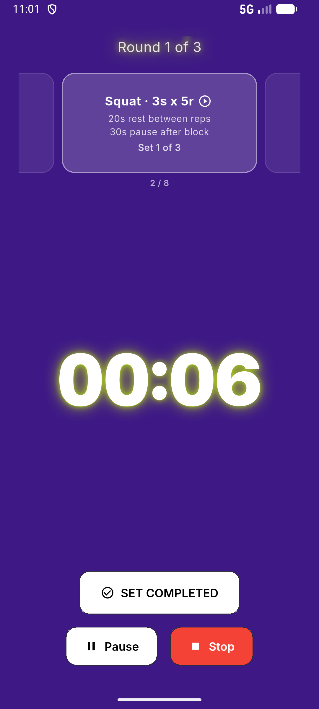
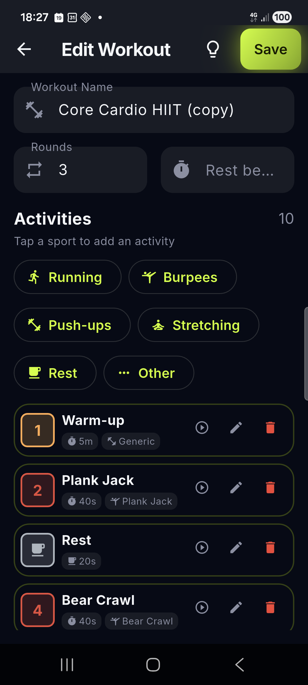
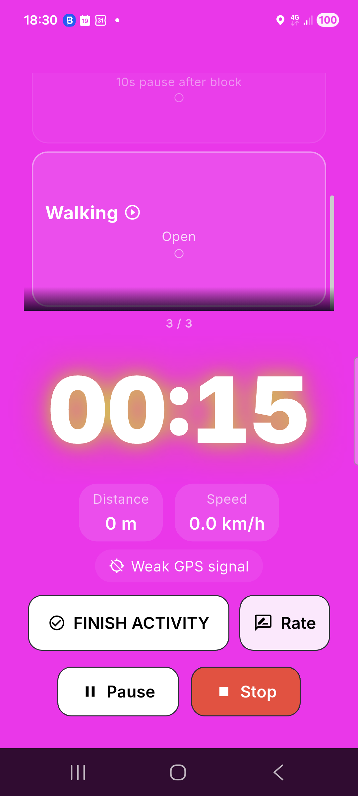

# Blocktomic — Workout & Timer Guide

> How to create, customize, and run workouts in Blocktomic.

---

## Understanding Workout Structure

A workout in Blocktomic is organized like this:

```
Workout
├── Round 1 (repeats N times)
│   ├── Block 1  (e.g., 20s Sprint)
│   ├── Block 2  (e.g., 10s Rest)
│   └── ...
│   └── Rest between rounds (optional)
├── Round 2
│   └── ...
└── etc.
```

### Terminology

| Term | Meaning |
|---|---|
| **Block** | A single interval or exercise (e.g., "20s Sprint", "10 reps Bench Press") |
| **Round** | A sequence of blocks that repeats N times |
| **Rest between rounds** | Recovery time after completing one full round |
| **Workout** | The complete session (all rounds + all blocks) |

---

## Block Types

<p align="center">
  
</p>

Each block can be one of these types:

### Time Block
Countdown timer. Set seconds or minutes:seconds.

**Use for**: Tabata intervals, timed exercises, rest periods.

Example: `20s work / 10s rest` (classic Tabata).

### Distance Block
Track distance using GPS or manual input.

**Use for**: Running, cycling, walking, rowing intervals.

Example: `Run 400m`, `Cycle 1km`.

During the workout:
- **With GPS**: the progress bar fills automatically as you move.
- **Without GPS**: tap the distance button to enter distance manually.

### Reps Block
Track sets and repetitions. No timer — mark sets as completed.

**Use for**: Gym exercises, strength training.

Example: `Bench Press — 3 sets × 12 reps @ 60kg`.

During the workout:
- Tap to mark a set as complete.
- Optionally log weight used.

### Open-Ended Block
Stopwatch-style block with no preset duration or target.

**Use for**: Stretching, cooldown, exercises where duration varies.

Example: `Stretch — finish when ready`.

During the workout:
- Timer runs upward.
- Tap **Complete** when you're done.

---

## Block Kinds

| Kind | Purpose | Color indicator |
|---|---|---|
| **Workout** | Main effort block | Theme color |
| **Warm-up** | Preparation exercise | Yellow/amber |
| **Cool-down** | Recovery exercise | Blue |
| **Rest** | Rest period | Grey |

---

## Activities

Each block is linked to an activity from Blocktomic's catalog of 100+ activities. Activities are organized by **sport family**:

| Family | Examples |
|---|---|
| **Endurance** | Running, Cycling, Walking, Rowing, Swimming |
| **HIIT** | Burpees, Mountain Climbers, Jump Squats, Box Jumps |
| **Gym** | Bench Press, Squat, Deadlift, Lat Pulldown, Bicep Curl |
| **Calisthenics** | Pull-ups, Push-ups, Dips, Pistol Squats, Plank |
| **Flexibility** | Quad Stretch, Hamstring Stretch, Cat-Cow, Child's Pose |
| **Other** | Custom activity, General exercise |

---

## Creating a Workout Step by Step

<p align="center">
  
</p>

1. **Navigate** to Workouts > My Workouts.
2. **Tap +** to create a new workout.
3. **Name your workout** (e.g., "Full Body Tabata").
4. **Add blocks**:
   - Tap **+ Add Block**.
   - Choose a **Name** (e.g., "Sprint").
   - Select **Type**: Time / Distance / Reps / Open-ended.
   - Select **Kind**: Workout / Warm-up / Cool-down / Rest.
   - Choose an **Activity** (tap to browse, use the search bar, or pick one of the **quick-add chips** right in the form).
   - Set **Duration / Distance / Reps** depending on type.
   - Optional: set **Weight target**, **Sets**, **Rest between sets**.
   - Toggle **Ask for feedback** if you want to rate this block after completion.
   - Toggle **Rest after block** and set duration.
5. **Reorder blocks** by dragging the handle (≡) on each block.
6. **Set rounds**:
   - Enter the number of times the block sequence repeats.
   - Set **Rest between rounds**.
7. **Tap Save**.

> **Note on block names**: Default block names (Warm-up, Rest, "Activity 1", sport names) auto-translate when you change the app language. Your custom names stay as typed.

---

## Starting a Workout

1. From the **Workout Preview** screen, review the structure.
2. Tap **Start**.
3. If there are distance blocks:
   - **GPS Priming screen** appears.
   - Tap **Allow GPS** or **Continue without GPS**.
4. **Start delay** (0–15 seconds, configurable in Settings).
5. The **Timer Screen** opens fullscreen.

---

## Using the Timer Screen

The timer screen is your control center during a workout.

### Display Elements

| Element | Description |
|---|---|
| **Current block name** | At the top (e.g., "Sprint") |
| **Activity name** | Below block name (e.g., "Running") |
| **Timer / Progress** | Center: countdown, stopwatch, or progress bar |
| **Phase indicator** | Shows current phase of the block |
| **Overall progress** | Bar at the bottom showing total workout progress |
| **Next block** | Small card showing what's coming next |
| **Countdown pulse** | With the **Overdrive** style, the screen pulses during the last 3 seconds of a block |

### Actions

| Action | How |
|---|---|
| **Pause** | Tap the pause button (⏸) |
| **Resume** | Tap the play button (▶) |
| **Skip rest** | During a rest block, tap **Skip Rest** |
| **Skip work block** | During a work block, tap **Skip**: the partial time or distance already done is still recorded |
| **Stop workout** | Tap stop (⏹), confirm |
| **Mark reps set complete** | Tap the checkbox (only in reps blocks) |
| **Complete open-ended block** | Tap **Complete** (only in open-ended blocks) |
| **Rate block** | After blocks with feedback enabled: tap Easy / Normal / Hard / Not completed — your choice stays highlighted for the whole rest |

### Audio & Vibration

- **Beep start**: short beep when a new phase begins.
- **Beep end**: different-pitch beep when a phase ends.
- **Vibration**: short pulse at phase changes.
- All configurable in Settings > Audio / Vibration.

### Background Behavior

| Scenario | Behavior |
|---|---|
| **App goes to background** | Timer pauses, beeps stop, GPS pauses |
| **App comes back to foreground** | Timer screen resumes |
| **Notification (GPS tracking)** | Persistent notification: "Workout in progress" |

---

## GPS Workouts

<p align="center">
  
</p>

GPS is used for distance-based blocks in endurance activities.

### Setting Up a GPS Workout

Create a block with type **Distance** and an activity like Running, Cycling, or Walking.

Example: `Run with Repeats` workout:
- Block 1: Run 400m (Distance, Running)
- Block 2: Rest 60s (Time, Rest kind)
- Round 1 repeats: 6 times
- Rest between rounds: 120s

### During GPS Tracking

- **Progress bar**: fills from 0 to target distance.
- **Distance readout**: current distance covered.
- **Speed**: instantaneous speed in km/h or mph.
- **Manual entry**: tap the distance number to type a value (when GPS is off).

### GPS Tips

- For best accuracy, keep your phone in an armband or pocket with a clear view of the sky.
- GPS data is **only stored on your device**.
- Blocktomic requests **location permission** only during active workouts.
- You can always choose to enter distance manually.

---

## Reps & Gym Workouts

### Setting Up a Gym Workout

Create blocks with type **Reps** for strength exercises.

Example: `Full Body Gym` workout:
- Block 1: Bench Press — 3 sets × 10 reps @ 60kg
- Block 2: Rest 90s (Time, Rest kind)
- Block 3: Squat — 3 sets × 12 reps @ 80kg
- Block 4: Rest 90s
- Block 5: Pull-ups — 3 sets × 8 reps
- Rounds: 1 (no repeat)

### During Gym Workouts

- Each reps block shows: target weight, sets, and reps per set.
- Tap **Complete Set** after each set.
- Timer is independent — you control the pace.
- Use the rest blocks to time your recovery between sets.

---

## Completed Workout

When you finish (or stop) a workout:

1. **Completion screen** shows:
   - Total duration vs. net training time
   - Distance covered (if applicable)
   - Average speed (if GPS used)
   - Badges unlocked (with animation)
2. Tap **Back to Home**.
3. The session is saved to:
   - **History** — full details
   - **Progress** — streak updated, stats updated
   - **Calendar** — heatmap updated

---

## Sharing Workouts

1. Open the **Workout Preview** (or tap the share icon on any card).
2. Tap **Share**: a sheet opens with a **QR code** and a link.
3. Send the link via any app (WhatsApp, Telegram, email, etc.) — or let a friend scan the QR code with their camera.
4. The recipient opens/scans it:
   - Blocktomic shows the **Import Preview** screen.
   - They tap **Import** to add a copy to their library.
   - A new unique workout is created (never overwrites existing).
5. Online, a short anonymous link is generated; fully offline, the whole workout is encoded inside the link itself.

---

## Pre-built Workouts

Blocktomic ships with **40 ready-to-use workouts** across every family:

| Family | Count | Highlights |
|---|---|---|
| HIIT | 11 | Classic Tabata, HIIT 30/30, Pyramid 60/30, HIIT Total Burn, EMOM 20min, AMRAP 15min, Deck of Cards, Partner WOD |
| Gym | 10 | Strength 45/15, Full Body Circuits A/B, Upper Body Push/Pull, Lower Body Quads/Posterior Chain |
| Endurance | 5 | Run with Repeats, Fartlek Pyramid, Hill Repeats, Tempo Run, Long Run |
| Calisthenics | 4 | Push, Pull, Core, Skills |
| Flexibility | 3 | Mobility Flow, Yoga Flow, Foam Rolling |
| Other | 7 | Core Circuit, Core Finisher, Plank Variations, Active Recovery, Pomodoro Timer |

Each pre-built workout has a difficulty rating (*Easy / Intermediate / Hard / Beast*) and — where applicable — a catchy title you'll see on cards when fun names are on (e.g. *Classic Tabata* → *Phoenix Protocol*).

Card durations are estimates: warm-up and cool-down count once, core blocks are multiplied by rounds.

You can **duplicate** any pre-built workout (keeping its catchy title) and customize it to your needs.